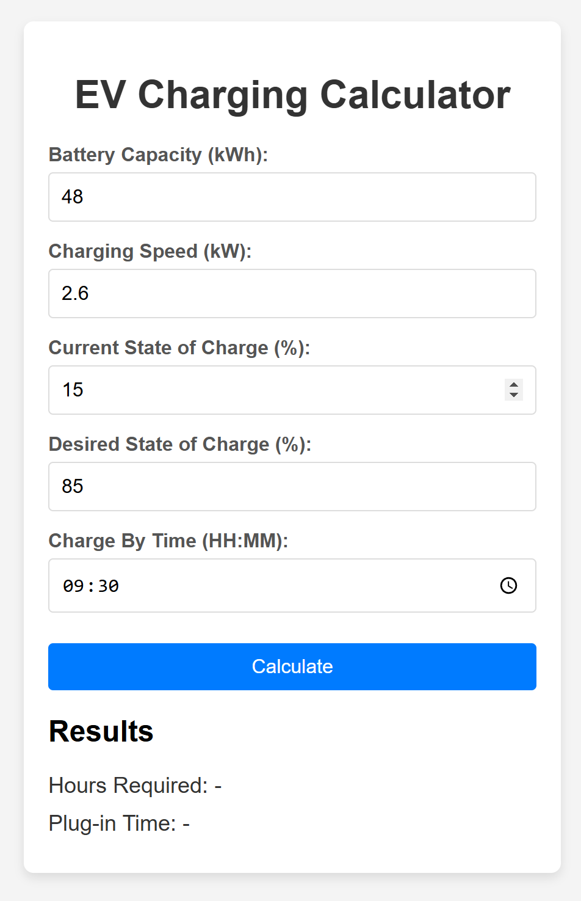

# EV Charging Calculator

A simple web tool for electric vehicle (EV) owners to calculate the number of hours required to charge their car to a desired level by a specified time. This tool is built using plain HTML, CSS, and JavaScript, with no external dependencies or frameworks.

This is specifically made for EVs that don't have a feature to limit charging and chargers that don't allow you to set limits on the state of charge.

## Features

- **Input Fields**:
  - **Battery Capacity (kWh)**: Total battery capacity of the EV.
  - **Charging Speed (kW)**: Charging speed of the EV charger.
  - **Current State of Charge (%)**: The current charge level of the EV’s battery as a percentage.
  - **Desired State of Charge (%)**: The desired charge level to reach by the end of the charging session.
  - **Charge By Time (HH:MM)**: The target time by which the EV should reach the desired charge.

- **Output**:
  - **Hours Required**: Estimated time in hours required to reach the target charge level.
  - **Plug-in Time**: The recommended time to plug in the EV to reach the desired charge level by the target time.

- **Persistent Input Data**: Stores input values in the browser's local storage to retain them on future visits.

## Demo

## How to Use

1. Open the `index.html` file in any modern web browser (no internet connection required).
2. Enter the following information in the form fields:
   - **Battery Capacity**: Enter the total capacity of your EV’s battery in kilowatt-hours (kWh).
   - **Charging Speed**: Enter the charging speed of your charger in kilowatts (kW).
   - **Current State of Charge**: Enter the current charge percentage (e.g., if the battery is 15% charged, enter `15`).
   - **Desired State of Charge**: Enter the desired charge percentage you want to reach.
   - **Charge By Time**: Enter the time by which you want the EV to reach the desired charge level (in HH:MM format).
3. Click the **Calculate** button to view:
   - **Hours Required**: The estimated number of hours needed to charge your EV from the current charge to the desired charge level.
   - **Plug-in Time**: The time you need to start charging your EV to reach the desired charge level by the specified time.

4. The tool automatically saves your inputs, so they will be available if you reload or revisit the page.

## Example

### Inputs
- **Battery Capacity**: `48` kWh
- **Charging Speed**: `2.6` kW
- **Current State of Charge**: `15`%
- **Desired State of Charge**: `85`%
- **Charge By Time**: `09:30`

### Results
- **Hours Required**: `12.92` hours
- **Plug-in Time**: `21:34`

## Technical Details

- **Languages Used**: HTML, CSS, JavaScript
- **Dependencies**: None (no external libraries or frameworks)
- **Local Storage**: Used to retain input values across sessions, providing a better user experience.

## Setup

1. Download or clone this repository.
2. Open the `index.html` file in any modern web browser.
3. Start using the tool by entering the values in the form and clicking **Calculate**.

## Browser Compatibility

This tool should work on most modern web browsers (Chrome, Firefox, Safari, Edge). It does not require an internet connection, as it is built with plain HTML, CSS, and JavaScript.

## License

This project is open source and available under the MIT License.

---

Enjoy using the EV Charging Calculator! If you encounter any issues or have suggestions for improvements, feel free to open an issue or contribute.
